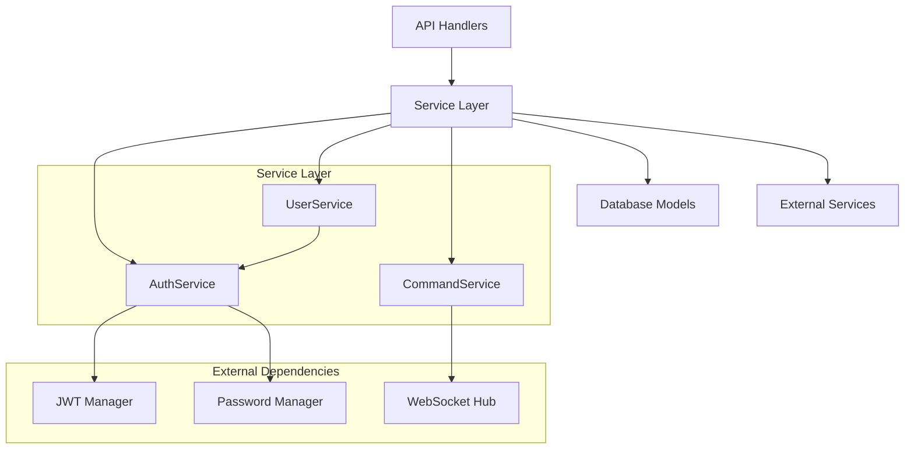
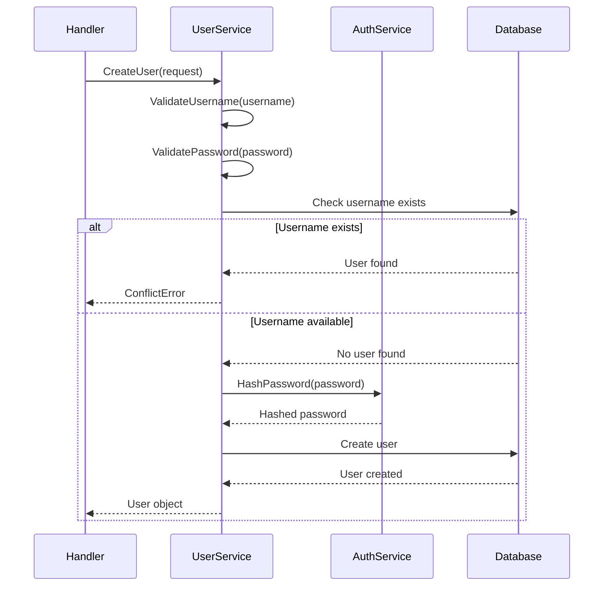
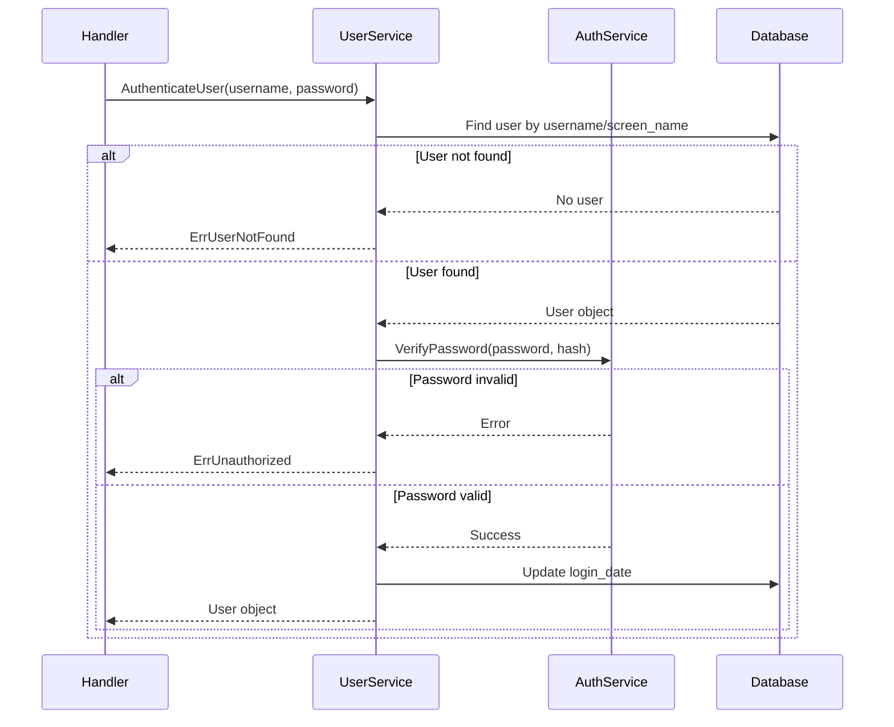
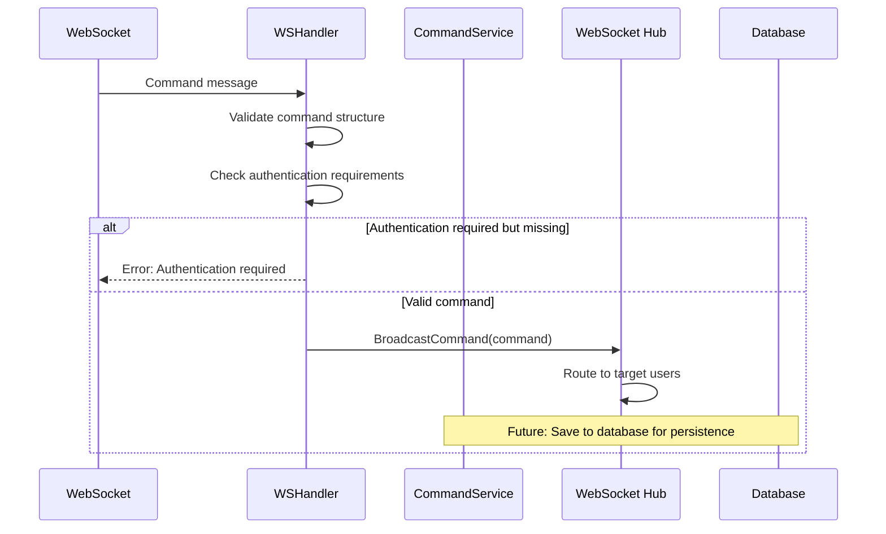

# Services and Business Logic

## Overview

The ControlApp Server implements a layered architecture with a dedicated service layer that encapsulates business logic, data validation, and domain operations. The service layer acts as an intermediary between the API handlers and the database models, ensuring proper separation of concerns and reusable business logic.

## Architecture

### Service Layer Structure



### Design Principles

1. **Single Responsibility**: Each service handles one domain area
2. **Dependency Injection**: Services receive dependencies via constructors
3. **Interface Segregation**: Clear interfaces for testability
4. **Error Handling**: Structured error types with context
5. **Validation**: Input validation at service boundaries
6. **Transaction Safety**: Database operations with proper error handling

## Core Services

### AuthService

Handles authentication, JWT tokens, and password management.

```go
type AuthService struct {
    JWTManager      *JWTManager
    PasswordManager *PasswordManager
}
```

#### Responsibilities
- JWT token generation and validation
- Password hashing and verification
- Authentication claims management
- Token expiration handling

#### Key Methods

##### JWT Operations
```go
// Generate JWT token for user
func (jm *JWTManager) GenerateToken(userID uuid.UUID) (string, error)

// Validate JWT token and extract claims
func (jm *JWTManager) ValidateToken(tokenString string) (*Claims, error)

// Parse JWT token without validation (for debugging)
func ParseJWT(tokenStr string) (*Claims, error)
```

##### Password Operations
```go
// Hash password using bcrypt
func (pm *PasswordManager) HashPassword(password string) (string, error)

// Verify password against hash
func (pm *PasswordManager) VerifyPassword(password, hash string) error
```

#### Configuration
```go
func NewAuthService(secret string, jwtExpiration time.Duration) *AuthService
```

#### Example Usage
```go
// Initialize service
authService := auth.NewAuthService("secret-key", 24*time.Hour)

// Hash password
hashedPassword, err := authService.PasswordManager.HashPassword("user-password")

// Generate token
token, err := authService.JWTManager.GenerateToken(userID)

// Validate token
claims, err := authService.JWTManager.ValidateToken(tokenString)
```

### UserService

Manages user accounts, authentication, and profile operations.

```go
type UserService struct {
    db   *gorm.DB
    Auth *auth.AuthService
}
```

#### Responsibilities
- User registration and validation
- User authentication
- Profile management
- User lookup operations
- Business rule enforcement

#### Key Methods

##### User Creation
```go
func (us *UserService) CreateUser(req CreateUserRequest) (*models.User, error)
```

**Validation Rules:**
- Username: 3-50 characters, no leading/trailing spaces, unique
- Screen name: 3-50 characters, no leading/trailing spaces, unique
- Password: 6-128 characters, bcrypt hashed
- Duplicate checking on both `login_name` and `screen_name`

**Error Types:**
- `ValidationError`: Field validation failures
- `ConflictError`: Duplicate username/screen name
- Database errors: Connection or constraint issues

##### User Authentication
```go
func (us *UserService) AuthenticateUser(username, password string) (*models.User, error)
```

**Process:**
1. Lookup user by `login_name` OR `screen_name`
2. Verify password using bcrypt
3. Update `login_date` on successful authentication
4. Return user object (password field excluded)

**Error Types:**
- `ErrUserNotFound`: User doesn't exist
- `ErrUnauthorized`: Invalid password
- Database errors: Connection issues

##### User Lookup
```go
// Get all users (admin operation)
func (us *UserService) GetAllUsers() ([]models.User, error)

// Get user by UUID
func (us *UserService) GetUserByID(id uuid.UUID) (*models.User, error)

// Get user by username or screen name
func (us *UserService) GetUserByUsername(username string) (*models.User, error)
```

#### Validation Functions

##### Username Validation
```go
func ValidateUsername(username string) *ValidationError {
    // Checks:
    // - Length: 3-50 characters
    // - Format: No leading/trailing spaces
    // - Returns structured error with field, message, code
}
```

##### Password Validation
```go
func ValidatePassword(password string) *ValidationError {
    // Checks:
    // - Length: 6-128 characters
    // - Returns structured error with field, message, code
}
```

#### Example Usage
```go
// Initialize service
userService := services.NewUserService(db, authService)

// Register new user
req := services.CreateUserRequest{
    LoginName:   "john_doe",
    ScreenName:  "John Doe", 
    Password:    "secure_password",
    RandomOptIn: false,
}
user, err := userService.CreateUser(req)

// Authenticate user
user, err := userService.AuthenticateUser("john_doe", "secure_password")

// Get user by ID
user, err := userService.GetUserByID(userID)
```

### CommandService

Manages command lifecycle, delivery, and status tracking.

```go
type CommandService struct {
    db *gorm.DB
}
```

#### Responsibilities
- Command status management
- Pending command retrieval
- Command completion tracking
- Command lookup with relationships

#### Key Methods

##### Command Retrieval
```go
// Get pending commands for a specific user
func (cs *CommandService) GetPendingCommands(userID uuid.UUID) ([]models.Command, error)

// Get count of pending commands
func (cs *CommandService) GetPendingCommandCount(userID uuid.UUID) (int64, error)

// Get command by ID with full relationships
func (cs *CommandService) GetCommandByID(commandID uuid.UUID) (*models.Command, error)
```

##### Command Status Management
```go
// Mark command as completed
func (cs *CommandService) CompleteCommand(commandID uuid.UUID, userID uuid.UUID) error
```

**Business Rules:**
- Only the receiver can complete a command
- Command must exist and be in "pending" status
- Updates `status` to "completed"
- Returns error if command not found or access denied

#### Command Lifecycle States

1. **Pending**: Command created, awaiting delivery/execution
2. **Delivered**: Command sent to client (future enhancement)
3. **Completed**: Command execution confirmed by recipient

#### Example Usage
```go
// Initialize service
commandService := services.NewCommandService(db)

// Get pending commands for user
commands, err := commandService.GetPendingCommands(userID)

// Complete a command
err := commandService.CompleteCommand(commandID, userID)

// Get command details
command, err := commandService.GetCommandByID(commandID)
```

## Error Handling

### Standard Error Types

The service layer defines standard error types following HTTP conventions:

```go
var (
    ErrUserNotFound = errors.New("user not found")
    ErrUnauthorized = errors.New("authentication failed")
    ErrConflict     = errors.New("resource conflict")
    ErrValidation   = errors.New("validation error")
    ErrBadRequest   = errors.New("bad request")
)
```

### Structured Error Types

#### ValidationError
```go
type ValidationError struct {
    Field   string  // Field name that failed validation
    Message string  // Human-readable error message
    Code    string  // Machine-readable error code
}
```

**Error Codes:**
- `MIN_LENGTH`: Field too short
- `MAX_LENGTH`: Field too long
- `INVALID_FORMAT`: Invalid format/characters
- `REQUIRED`: Required field missing

#### ConflictError
```go
type ConflictError struct {
    Resource string  // Resource type (e.g., "username")
    Value    string  // Conflicting value
    Message  string  // Error description
}
```

### Error Propagation

Services return structured errors that handlers convert to HTTP responses:

```go
// Service layer
user, err := userService.CreateUser(req)
if err != nil {
    if validationErr, ok := err.(*ValidationError); ok {
        // Return 422 Unprocessable Entity
    }
    if conflictErr, ok := err.(*ConflictError); ok {
        // Return 409 Conflict
    }
    // Return 500 Internal Server Error
}
```

## Business Logic

### User Registration Flow



### Authentication Flow



### Command Processing Flow



## Service Integration

### Dependency Injection

Services are initialized with their dependencies in the routing setup:

```go
func SetupRoutes(router *gin.Engine, db *gorm.DB, hub *websocket.Hub, cfg *config.Config) {
    // Initialize services with dependencies
    jwtExpiration := time.Duration(cfg.Auth.JWTExpiration) * time.Second
    authService := auth.NewAuthService(cfg.Auth.JWTSecret, jwtExpiration)
    userService := services.NewUserService(db, authService)
    commandService := services.NewCommandService(db)
    
    // Initialize handlers with services
    userHandlers := handlers.NewUserHandlers(userService)
    authHandlers := handlers.NewAuthHandlers(userService)
    commandHandlers := handlers.NewCommandHandlers(commandService)
    wsHandlers := handlers.NewWebSocketHandlers(hub, authService.JWTManager, userService)
}
```

### Service Composition

Services can be composed to create higher-level operations:

```go
// Example: Complete user registration with automatic login
func (us *UserService) RegisterAndLogin(req CreateUserRequest) (*models.User, string, error) {
    // Create user
    user, err := us.CreateUser(req)
    if err != nil {
        return nil, "", err
    }
    
    // Generate token
    token, err := us.Auth.JWTManager.GenerateToken(user.ID)
    if err != nil {
        return user, "", err
    }
    
    return user, token, nil
}
```

## Testing

### Unit Testing Services

```go
func TestUserService_CreateUser(t *testing.T) {
    // Setup test database
    db := setupTestDB()
    authService := auth.NewAuthService("test-secret", time.Hour)
    userService := services.NewUserService(db, authService)
    
    // Test valid user creation
    req := services.CreateUserRequest{
        LoginName:   "testuser",
        ScreenName:  "Test User",
        Password:    "password123",
        RandomOptIn: false,
    }
    
    user, err := userService.CreateUser(req)
    assert.NoError(t, err)
    assert.Equal(t, "testuser", user.LoginName)
    assert.NotEmpty(t, user.ID)
    
    // Test duplicate username
    _, err = userService.CreateUser(req)
    assert.Error(t, err)
    assert.IsType(t, &services.ConflictError{}, err)
}
```

### Integration Testing

```go
func TestCompleteUserFlow(t *testing.T) {
    db := setupTestDB()
    authService := auth.NewAuthService("test-secret", time.Hour)
    userService := services.NewUserService(db, authService)
    
    // Register user
    req := services.CreateUserRequest{
        LoginName:  "testuser",
        ScreenName: "Test User", 
        Password:   "password123",
    }
    user, err := userService.CreateUser(req)
    require.NoError(t, err)
    
    // Authenticate user
    authUser, err := userService.AuthenticateUser("testuser", "password123")
    require.NoError(t, err)
    assert.Equal(t, user.ID, authUser.ID)
    
    // Invalid authentication
    _, err = userService.AuthenticateUser("testuser", "wrongpassword")
    assert.Equal(t, services.ErrUnauthorized, err)
}
```

### Mocking Services

```go
type MockUserService struct {
    users map[string]*models.User
}

func (m *MockUserService) AuthenticateUser(username, password string) (*models.User, error) {
    if user, exists := m.users[username]; exists && password == "correct" {
        return user, nil
    }
    return nil, services.ErrUnauthorized
}

func TestHandlerWithMockService(t *testing.T) {
    mockService := &MockUserService{
        users: map[string]*models.User{
            "testuser": {ID: uuid.New(), LoginName: "testuser"},
        },
    }
    
    handler := handlers.NewAuthHandlers(mockService)
    // Test handler logic...
}
```

## Performance Considerations

### Database Optimization

1. **Query Optimization**
   - Use `Preload` for relationships only when needed
   - Select specific fields instead of full objects
   - Implement pagination for large result sets

2. **Connection Management**
   - Reuse database connections
   - Configure connection pooling for PostgreSQL
   - Monitor connection usage

3. **Caching Strategy**
   - Cache frequently accessed user data
   - Implement Redis for session management
   - Cache validation results

### Example Optimizations

```go
// Efficient user lookup with minimal data
func (us *UserService) GetUserSummary(id uuid.UUID) (*UserSummary, error) {
    var summary UserSummary
    err := us.db.Select("id, login_name, screen_name, role").
        First(&summary, "id = ?", id).Error
    return &summary, err
}

// Paginated command retrieval
func (cs *CommandService) GetPendingCommandsPaginated(userID uuid.UUID, limit, offset int) ([]models.Command, error) {
    var commands []models.Command
    err := cs.db.Where("receiver_id = ? AND status = ?", userID, "pending").
        Limit(limit).Offset(offset).
        Order("created_at DESC").
        Find(&commands).Error
    return commands, err
}
```

## Security Considerations

### Input Validation

All user inputs are validated at the service layer:

```go
// Sanitize and validate username
func (us *UserService) sanitizeUsername(username string) string {
    return strings.TrimSpace(username)
}

// Validate all fields before database operations
func (us *UserService) validateCreateRequest(req CreateUserRequest) error {
    if err := ValidateUsername(req.LoginName); err != nil {
        return err
    }
    if err := ValidatePassword(req.Password); err != nil {
        return err
    }
    return nil
}
```

### Password Security

- bcrypt hashing with appropriate cost factor
- No plaintext password storage or logging
- Secure password comparison using constant-time functions

### Access Control

```go
// Ensure users can only access their own data
func (cs *CommandService) CompleteCommand(commandID uuid.UUID, userID uuid.UUID) error {
    result := cs.db.Model(&models.Command{}).
        Where("id = ? AND receiver_id = ?", commandID, userID).
        Update("status", "completed")
    
    if result.RowsAffected == 0 {
        return fmt.Errorf("command not found or access denied")
    }
    return nil
}
```

## Future Enhancements

### Planned Service Improvements

1. **Command Persistence**: Save WebSocket commands to database
2. **User Preferences**: Service for managing user settings
3. **Moderation Service**: Automated content filtering
4. **Analytics Service**: User activity and system metrics
5. **Notification Service**: Email/push notification delivery
6. **Audit Service**: Security and compliance logging

### Scalability Considerations

1. **Service Decomposition**: Split services into microservices
2. **Event-Driven Architecture**: Use message queues for async processing
3. **Caching Layer**: Redis for high-performance data access
4. **Read Replicas**: Separate read/write database connections
5. **Rate Limiting**: Service-level request throttling