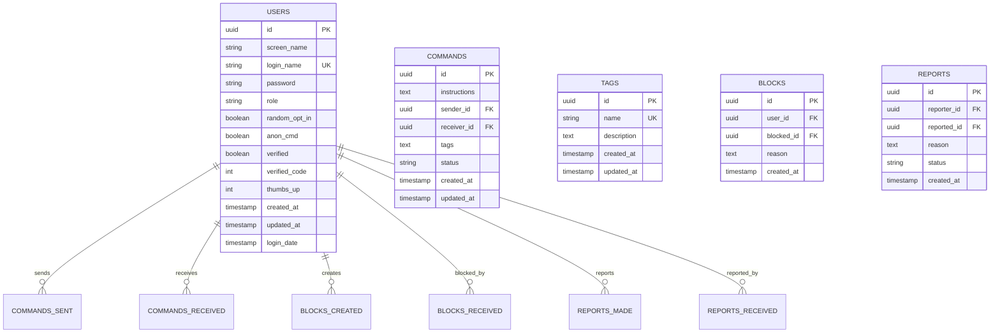

# Database Models & Schema

## Overview

The ControlApp Server uses GORM (Go Object-Relational Mapping) with support for both PostgreSQL and SQLite databases. The schema is designed for a command distribution system with user management, authentication, and real-time communication features.

## Database Support

### Supported Databases

1. **PostgreSQL** (Primary, Production Recommended)
   - Full feature support
   - UUID extension (`uuid-ossp`)
   - Advanced indexing and constraints
   - Connection pooling

2. **SQLite** (Development/Fallback)
   - Automatic fallback if PostgreSQL unavailable
   - File-based storage
   - Single-user development

### Configuration

```yaml
# config.yaml
database:
  type: "postgres"        # or "sqlite"
  host: "localhost"
  port: 5432
  name: "controlapp"
  username: "postgres"
  password: "password"
  ssl_mode: "disable"
  path: "./data/app.db"   # SQLite only
```

## Core Models

### User Model

Represents system users with authentication and profile information.

```go
type User struct {
    ID           uuid.UUID `gorm:"type:uuid;primary_key" json:"id"`
    ScreenName   string    `gorm:"size:50;not null" json:"screen_name"`
    LoginName    string    `gorm:"size:50;not null;unique" json:"login_name"`
    Password     string    `gorm:"size:255;not null" json:"-"`
    Role         string    `gorm:"size:50" json:"role"`
    RandomOptIn  bool      `gorm:"default:false" json:"random_opt_in"`
    AnonCmd      bool      `gorm:"default:false" json:"anon_cmd"`
    Verified     bool      `gorm:"default:false" json:"verified"`
    VerifiedCode int       `gorm:"default:0" json:"verified_code"`
    ThumbsUp     int       `gorm:"default:0" json:"thumbs_up"`
    CreatedAt    time.Time `json:"created_at"`
    UpdatedAt    time.Time `json:"updated_at"`
    LoginDate    time.Time `json:"login_date"`
}
```

#### Table: `users`

| Column | Type | Constraints | Description |
|--------|------|-------------|-------------|
| `id` | UUID | PRIMARY KEY, DEFAULT uuid_generate_v4() | Unique user identifier |
| `screen_name` | VARCHAR(50) | NOT NULL | Display name for user |
| `login_name` | VARCHAR(50) | NOT NULL, UNIQUE | Username for authentication |
| `password` | VARCHAR(255) | NOT NULL | bcrypt hashed password |
| `role` | VARCHAR(50) | NULL | User role (default: "user") |
| `random_opt_in` | BOOLEAN | DEFAULT false | Opt-in for random commands |
| `anon_cmd` | BOOLEAN | DEFAULT false | Allow anonymous commands |
| `verified` | BOOLEAN | DEFAULT false | Account verification status |
| `verified_code` | INTEGER | DEFAULT 0 | Verification code |
| `thumbs_up` | INTEGER | DEFAULT 0 | User rating/score |
| `created_at` | TIMESTAMPTZ | DEFAULT NOW() | Account creation time |
| `updated_at` | TIMESTAMPTZ | DEFAULT NOW() | Last update time |
| `login_date` | TIMESTAMPTZ | DEFAULT NOW() | Last login time |

#### Indexes
- `idx_users_login_name` (UNIQUE) on `login_name`
- `idx_users_role` on `role`
- `idx_users_created_at` on `created_at`

#### Business Rules
- `login_name` must be unique across all users
- `screen_name` must be unique across all users (enforced at application level)
- Passwords are stored as bcrypt hashes
- `login_date` updated on successful authentication

### Command Model

Represents command instructions sent between users.

```go
type Command struct {
    ID           uuid.UUID     `gorm:"type:uuid;primary_key" json:"id"`
    Instructions []Instruction `gorm:"serializer:json;type:text;not null" json:"instructions"`
    SenderID     uuid.UUID     `gorm:"type:uuid;not null;constraint:OnDelete:CASCADE" json:"sender_id"`
    ReceiverID   *uuid.UUID    `gorm:"type:uuid;constraint:OnDelete:SET NULL" json:"receiver_id,omitempty"`
    Tags         string        `gorm:"type:text" json:"tags"`
    Status       string        `gorm:"size:20;default:'pending'" json:"status"`
    CreatedAt    time.Time     `json:"created_at"`
    UpdatedAt    time.Time     `json:"updated_at"`

    // Relationships
    Sender   User  `gorm:"foreignKey:SenderID;references:ID" json:"sender"`
    Receiver *User `gorm:"foreignKey:ReceiverID;references:ID" json:"receiver,omitempty"`
}
```

#### Table: `commands`

| Column | Type | Constraints | Description |
|--------|------|-------------|-------------|
| `id` | UUID | PRIMARY KEY, DEFAULT uuid_generate_v4() | Unique command identifier |
| `instructions` | TEXT | NOT NULL | JSON array of instruction objects |
| `sender_id` | UUID | NOT NULL, FK → users(id) ON DELETE CASCADE | User who sent the command |
| `receiver_id` | UUID | NULL, FK → users(id) ON DELETE SET NULL | Target user (NULL for broadcast) |
| `tags` | TEXT | NULL | Comma-separated tags for categorization |
| `status` | VARCHAR(20) | DEFAULT 'pending' | Command status |
| `created_at` | TIMESTAMPTZ | DEFAULT NOW() | Command creation time |
| `updated_at` | TIMESTAMPTZ | DEFAULT NOW() | Last update time |

#### Indexes
- `idx_commands_sender_id` on `sender_id`
- `idx_commands_receiver_id` on `receiver_id`
- `idx_commands_status` on `status`
- `idx_commands_created_at` on `created_at`

#### Status Values
- `pending`: Command created, awaiting delivery
- `delivered`: Command sent to client(s)
- `completed`: Command execution confirmed

#### Foreign Key Constraints
- `fk_commands_sender`: `sender_id` → `users(id)` ON DELETE CASCADE
- `fk_commands_receiver`: `receiver_id` → `users(id)` ON DELETE SET NULL

### Instruction Model

Embedded within Command, represents individual instruction steps.

```go
type Instruction struct {
    Type    string      `json:"type"`    // Instruction type identifier
    Content interface{} `json:"content"` // Arbitrary instruction data
}
```

#### Instruction Types
- `std_popup`: Display popup message
- `std_timer`: Start timer countdown
- `display_text`: Show text content
- `notification`: System notification
- `open_url`: Open web URL
- `download_file`: Download file instruction
- `form_input`: Interactive form
- Custom types supported

#### Example Instruction Content

```json
{
  "type": "std_popup",
  "content": {
    "body": "This is a test message",
    "button": "OK"
  }
}
```

### Tag Model

Represents content categories for command organization.

```go
type Tag struct {
    ID          uuid.UUID `gorm:"type:uuid;primary_key" json:"id"`
    Name        string    `gorm:"size:100;not null;unique" json:"name"`
    Description string    `gorm:"type:text" json:"description"`
    CreatedAt   time.Time `json:"created_at"`
    UpdatedAt   time.Time `json:"updated_at"`
}
```

#### Table: `tags`

| Column | Type | Constraints | Description |
|--------|------|-------------|-------------|
| `id` | UUID | PRIMARY KEY, DEFAULT uuid_generate_v4() | Unique tag identifier |
| `name` | VARCHAR(100) | NOT NULL, UNIQUE | Tag name/identifier |
| `description` | TEXT | NULL | Tag description |
| `created_at` | TIMESTAMPTZ | DEFAULT NOW() | Tag creation time |
| `updated_at` | TIMESTAMPTZ | DEFAULT NOW() | Last update time |

#### Indexes
- `idx_tags_name` (UNIQUE) on `name`
- `idx_tags_created_at` on `created_at`

#### Common Tags
- `general`: General purpose commands
- `chastity`: Chastity-related content
- `feet`: Feet-related content
- `adult`: Adult content
- `test`: Testing/development

### Block Model

Represents user blocking relationships.

```go
type Block struct {
    ID        uuid.UUID `gorm:"type:uuid;primary_key" json:"id"`
    UserID    uuid.UUID `gorm:"type:uuid;not null;constraint:OnDelete:CASCADE" json:"user_id"`
    BlockedID uuid.UUID `gorm:"type:uuid;not null;constraint:OnDelete:CASCADE" json:"blocked_id"`
    Reason    string    `gorm:"type:text" json:"reason"`
    CreatedAt time.Time `json:"created_at"`

    // Relationships
    User    User `gorm:"foreignKey:UserID;references:ID" json:"user"`
    Blocked User `gorm:"foreignKey:BlockedID;references:ID" json:"blocked"`
}
```

#### Table: `blocks`

| Column | Type | Constraints | Description |
|--------|------|-------------|-------------|
| `id` | UUID | PRIMARY KEY, DEFAULT uuid_generate_v4() | Unique block identifier |
| `user_id` | UUID | NOT NULL, FK → users(id) ON DELETE CASCADE | User performing the block |
| `blocked_id` | UUID | NOT NULL, FK → users(id) ON DELETE CASCADE | User being blocked |
| `reason` | TEXT | NULL | Optional reason for blocking |
| `created_at` | TIMESTAMPTZ | DEFAULT NOW() | Block creation time |

#### Indexes
- `idx_blocks_user_id` on `user_id`
- `idx_blocks_blocked_id` on `blocked_id`
- `idx_blocks_user_blocked` (UNIQUE) on `(user_id, blocked_id)`

#### Foreign Key Constraints
- `fk_blocks_user`: `user_id` → `users(id)` ON DELETE CASCADE
- `fk_blocks_blocked`: `blocked_id` → `users(id)` ON DELETE CASCADE

### Report Model

Represents user reports for moderation.

```go
type Report struct {
    ID         uuid.UUID `gorm:"type:uuid;primary_key" json:"id"`
    ReporterID uuid.UUID `gorm:"type:uuid;not null;constraint:OnDelete:CASCADE" json:"reporter_id"`
    ReportedID uuid.UUID `gorm:"type:uuid;not null;constraint:OnDelete:CASCADE" json:"reported_id"`
    Reason     string    `gorm:"type:text;not null" json:"reason"`
    Status     string    `gorm:"size:20;default:'pending'" json:"status"`
    CreatedAt  time.Time `json:"created_at"`

    // Relationships
    Reporter User `gorm:"foreignKey:ReporterID;references:ID" json:"reporter"`
    Reported User `gorm:"foreignKey:ReportedID;references:ID" json:"reported"`
}
```

#### Table: `reports`

| Column | Type | Constraints | Description |
|--------|------|-------------|-------------|
| `id` | UUID | PRIMARY KEY, DEFAULT uuid_generate_v4() | Unique report identifier |
| `reporter_id` | UUID | NOT NULL, FK → users(id) ON DELETE CASCADE | User making the report |
| `reported_id` | UUID | NOT NULL, FK → users(id) ON DELETE CASCADE | User being reported |
| `reason` | TEXT | NOT NULL | Report reason/description |
| `status` | VARCHAR(20) | DEFAULT 'pending' | Report status |
| `created_at` | TIMESTAMPTZ | DEFAULT NOW() | Report creation time |

#### Status Values
- `pending`: Report submitted, awaiting review
- `reviewed`: Report reviewed by moderator
- `resolved`: Report resolved/actioned
- `dismissed`: Report dismissed as invalid

#### Foreign Key Constraints
- `fk_reports_reporter`: `reporter_id` → `users(id)` ON DELETE CASCADE
- `fk_reports_reported`: `reported_id` → `users(id)` ON DELETE CASCADE

## Database Schema Relationships



## Database Initialization

### Migration Process

1. **Connection Establishment**
   - Try PostgreSQL first (if configured)
   - Fallback to SQLite if PostgreSQL fails
   - Test connection with ping

2. **Extension Setup** (PostgreSQL only)
   - Create `uuid-ossp` extension for UUID generation
   - Graceful handling if extension already exists

3. **Table Migration**
   - GORM AutoMigrate for each model
   - Manual table creation fallback
   - Dependency-aware migration order

4. **Index Creation**
   - Performance indexes on commonly queried fields
   - Unique constraints for business rules
   - Foreign key constraints

### Migration Order

```go
// Migration order (dependencies handled)
1. Users          // No dependencies
2. Tags           // No dependencies  
3. Commands       // Depends on Users
4. Blocks         // Depends on Users
5. Reports        // Depends on Users
```

### Manual Table Creation

If GORM AutoMigrate fails, the system falls back to manual SQL table creation:

```sql
-- Example: Users table
CREATE TABLE users (
    id UUID PRIMARY KEY DEFAULT uuid_generate_v4(),
    screen_name VARCHAR(50) NOT NULL,
    login_name VARCHAR(50) NOT NULL UNIQUE,
    password VARCHAR(255) NOT NULL,
    role VARCHAR(50),
    random_opt_in BOOLEAN DEFAULT false,
    anon_cmd BOOLEAN DEFAULT false,
    verified BOOLEAN DEFAULT false,
    verified_code BIGINT DEFAULT 0,
    thumbs_up BIGINT DEFAULT 0,
    created_at TIMESTAMPTZ DEFAULT NOW(),
    updated_at TIMESTAMPTZ DEFAULT NOW(),
    login_date TIMESTAMPTZ DEFAULT NOW()
);
```

## Database Configuration

### PostgreSQL Configuration

```yaml
database:
  type: "postgres"
  host: "localhost"
  port: 5432
  name: "controlapp"
  username: "postgres" 
  password: "your_password"
  ssl_mode: "disable"  # or "require" for production
```

### SQLite Configuration

```yaml
database:
  type: "sqlite"
  path: "./data/app.db"
```

### Environment Variables

```bash
# PostgreSQL
DB_TYPE=postgres
DB_HOST=localhost
DB_PORT=5432
DB_NAME=controlapp
DB_USERNAME=postgres
DB_PASSWORD=your_password
DB_SSL_MODE=disable

# SQLite
DB_TYPE=sqlite
DB_PATH=./data/app.db
```

## Query Examples

### User Operations

```go
// Create user
user := models.User{
    LoginName:   "john_doe",
    ScreenName:  "John Doe",
    Password:    hashedPassword,
    Role:        "user",
    RandomOptIn: false,
}
db.Create(&user)

// Find user by login name
var user models.User
db.Where("login_name = ?", "john_doe").First(&user)

// Get all users
var users []models.User
db.Find(&users)
```

### Command Operations

```go
// Create command
command := models.Command{
    Instructions: []models.Instruction{{
        Type:    "std_popup",
        Content: map[string]interface{}{"body": "Hello!"},
    }},
    SenderID:   senderID,
    ReceiverID: &receiverID,  // nil for broadcast
    Tags:       "general",
    Status:     "pending",
}
db.Create(&command)

// Get pending commands for user
var commands []models.Command
db.Where("receiver_id = ? AND status = ?", userID, "pending").
   Preload("Sender").
   Find(&commands)

// Get commands with relationships
var command models.Command
db.Preload("Sender").Preload("Receiver").First(&command, commandID)
```

### Blocking Operations

```go
// Block user
block := models.Block{
    UserID:    blockerID,
    BlockedID: blockedID,
    Reason:    "Spam",
}
db.Create(&block)

// Check if user is blocked
var count int64
db.Model(&models.Block{}).
   Where("user_id = ? AND blocked_id = ?", userID, otherUserID).
   Count(&count)
isBlocked := count > 0
```

## Performance Considerations

### Indexing Strategy

1. **Primary Keys**: UUID columns with proper indexing
2. **Foreign Keys**: Indexed for join performance
3. **Query Columns**: Status, timestamps for filtering
4. **Unique Constraints**: Login names, tag names

### Query Optimization

1. **Preloading**: Use GORM Preload for relationships
2. **Pagination**: Implement for large result sets
3. **Selective Fields**: Only query needed columns
4. **Connection Pooling**: Configure for PostgreSQL

### Example Optimized Queries

```go
// Paginated users with selective fields
var users []models.User
db.Select("id, login_name, screen_name, created_at").
   Limit(20).Offset(offset).
   Order("created_at DESC").
   Find(&users)

// Commands with minimal data
db.Select("id, sender_id, status, created_at").
   Where("status = ?", "pending").
   Find(&commands)
```

## Backup and Maintenance

### PostgreSQL Backup

```bash
# Full database backup
pg_dump -h localhost -U postgres controlapp > backup.sql

# Schema only
pg_dump -h localhost -U postgres --schema-only controlapp > schema.sql

# Data only
pg_dump -h localhost -U postgres --data-only controlapp > data.sql
```

### SQLite Backup

```bash
# Backup SQLite database
cp data/app.db data/app.db.backup

# Export to SQL
sqlite3 data/app.db .dump > backup.sql
```

### Maintenance Tasks

1. **Regular Backups**: Automated backup schedules
2. **Index Maintenance**: Monitor index usage and performance
3. **Log Cleanup**: Archive old command logs
4. **Connection Monitoring**: Monitor database connections
5. **Performance Monitoring**: Query performance analysis

## Development and Testing

### Test Database Setup

```go
// Test database configuration
func setupTestDB() *gorm.DB {
    db, _ := gorm.Open(sqlite.Open(":memory:"), &gorm.Config{})
    
    // Run migrations
    db.AutoMigrate(&models.User{}, &models.Command{}, &models.Tag{})
    
    return db
}
```

### Sample Data Creation

```go
// Create test users
func createTestData(db *gorm.DB) {
    users := []models.User{
        {LoginName: "alice", ScreenName: "Alice", Role: "user"},
        {LoginName: "bob", ScreenName: "Bob", Role: "user"},
        {LoginName: "admin", ScreenName: "Admin", Role: "admin"},
    }
    
    for _, user := range users {
        db.Create(&user)
    }
}
```

## Troubleshooting

### Common Issues

1. **Migration Failures**
   - Check database permissions
   - Verify connection settings
   - Review manual table creation logs

2. **Foreign Key Errors**
   - Ensure referenced records exist
   - Check cascade settings
   - Verify UUID format

3. **Unique Constraint Violations**
   - Handle duplicate usernames
   - Check application-level validation
   - Review index creation

4. **Performance Issues**
   - Add missing indexes
   - Optimize query patterns
   - Consider pagination

### Debug Logging

```yaml
# Enable SQL query logging
database:
  log_level: "info"  # Shows all SQL queries
```

```go
// Enable GORM debug mode
db.Debug().Create(&user)  // Logs SQL query
```